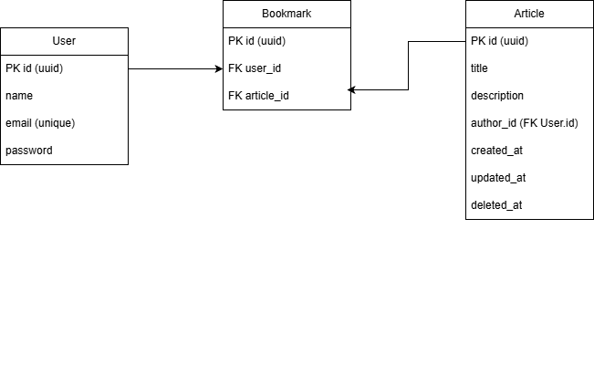

## 5. Design System: Sistem Bookmark Artikel

Bayangkan kamu sedang membangun fitur "Bookmark Artikel" di sebuah aplikasi
blog. User dapat:

1. Menyimpan artikel ke dalam daftar bookmark-nya.
2. Melihat semua artikel yang telah dibookmark.
3. Menghapus artikel dari daftar bookmark.

Pertanyaan:

1. Bagaimana struktur data atau tabelnya?
2. Bagaimana endpoint API-nya? (contoh: POST /bookmarks)
3. Bagaimana cara memastikan user hanya bisa melihat bookmark miliknya?
4. Apa yang terjadi jika artikel dihapus oleh penulisnya?
5. Bagaimana kamu memastikan satu artikel tidak dibookmark dua kali oleh
   user yang sama?

Jawaban:

## 1. Struktur data pada tabel dan relation antar tabel



table user:

- id -> uuid (primary key)
- name -> varchar(300)
- email -> varchar(300) (unique)
- password -> varchar(300)

table article:

- id -> uuid (primary key)
- title -> varchar(300)
- description -> text
- author_id -> uuid (Foreign key user.id)
- created_at -> date
- updated_at -> date
- deleted_at -> date | null

table bookmark:

- id -> uuid (primary key)
- user_id -> uuid (foreign key user.id)
- article_id -> uuid (foreign key article.id)

## 2. Endpoint untuk bookmark:

- GET /api/bookmark
- POST /api/bookmark
- PATCH /api/bookmark/:id
- DELETE /api/bookmark/:id

### Endpoint GET /api/bookmark

Request Header :

- X-API-TOKEN : token

Response Body (Success) :

```json
{
  "success": true,
  "message": "Get bookmark success",
  "data": [
    {
      "id": "fe9ca133-3e57-4b61-9537-399431c1e8f6",
      "title": "aticle-1",
      "description": "contoh article",
      "author_id": "hfdikenckxleodkn",
      "created_at": "2025-03-08T10:15:30.123Z",
      "updated_at": null,
      "deleted_at": null
    }
  ]
}
```

Response Body (Failed) :

```json
{
    "success": false,
    "message": "Unauthorized invalid"
    "data": null
}
```

### Endpoint POST /api/bookmark

Request Header :

- X-API-TOKEN : token

Request Body:

```json
{
  "id": "fe9ca133-3e57-4b61-9537-399431c1e8f6"
}
```

Response Body (Success) :

```json
{
  "success": true,
  "message": "Create article success",
  "data": {
    "id": "fe9ca133-3e57-4b61-9537-399431c1e8f6",
    "title": "article-1",
    "description": "contoh article",
    "author_id": "hfdikenckxleodkn",
    "created_at": "2025-03-08T10:15:30.123Z",
    "updated_at": null,
    "deleted_at": null
  }
}
```

Response Body (Failed) :

```json
{
    "success": false,
    "message": "id is required"
    "data": null
}
```

### Endpoint DELETE /api/bookmark/:id

Request Header :

- X-API-TOKEN : token

Response Body (Success):

```json
{
  "success": true,
  "message": "Delete bookmark article success",
  "data": "OK"
}
```

Response Body (Failed) :

```json
{
    "success": false,
    "message": "failed delete bookmark article"
    "data": null
}
```

### Endpoint GET /api/article

Request Header :

- X-API-TOKEN : token

Response Body (Success) :

```json
{
  "success": true,
  "message": "Get article success",
  "data": [
    {
      "id": "fe9ca133-3e57-4b61-9537-399431c1e8f6",
      "title": "article-1",
      "description": "contoh article",
      "author_id": "hfdikenckxleodkn",
      "created_at": "2025-03-08T10:15:30.123Z",
      "updated_at": null,
      "deleted_at": null
    }
  ]
}
```

Response Body (Failed) :

```json
{
    "success": false,
    "message": "Unauthorized invalid"
    "data": null
}
```

### Endpoint POST /api/article

Request Header :

- X-API-TOKEN : token

Request Body:

```json
{
  "title": "article-1",
  "description": "contoh article"
}
```

Response Body (Success) :

```json
{
  "success": true,
  "message": "Create article success",
  "data": {
    "id": "fe9ca133-3e57-4b61-9537-399431c1e8f6",
    "title": "article-1",
    "description": "contoh article",
    "author_id": "hfdikenckxleodkn",
    "created_at": "2025-03-08T10:15:30.123Z",
    "updated_at": null,
    "deleted_at": null
  }
}
```

Response Body (Failed) :

```json
{
    "success": false,
    "message": "title is required"
    "data": null
}
```

### Endpoint PATCH /api/article/:id

Request Header :

- X-API-TOKEN : token

Request Body :

```json
{
  "title": "article update",
  "description": "update article-1"
}
```

Response Body (Success):

```json
{
  "success": true,
  "message": "Update article success",
  "data": {
    "id": "fe9ca133-3e57-4b61-9537-399431c1e8f6",
    "title": "article update",
    "description": "update article",
    "author_id": "hfdikenckxleodkn",
    "created_at": "2025-03-08T10:15:30.123Z",
    "updated_at": "2025-03-08T10:18:30.123Z",
    "deleted_at": null
  }
}
```

Response Body (Failed) :

```json
{
    "success": false,
    "message": "title is required"
    "data": null
}
```

### Endpoint DELETE /api/article/:id

Request Header :

- X-API-TOKEN : token

Response Body (Success):

```json
{
  "success": true,
  "message": "Delete article success",
  "data": "OK"
}
```

Response Body (Failed) :

```json
{
    "success": false,
    "message": "failed delete article"
    "data": null
}
```

## 3 Handle Article bookmark for users

untuk memastikan bisa dengan cara menambahkan memanggil get list article menggunakan endpoint bookmark, dimana endpoint bookmark ini dengan cara membuat query dengan join table berdasarkan user_id yang didapatkan dari token ketika login.

```sql
    SELECT a.id, a.title, a.description, a.author_id
    FROM bookmark b
    JOIN article a ON a.id = b.article_id
    WHERE b.user_id = $id
    AND a.deleted_at IS NULL
```

## 4 article deleted by author user

Based on case apabila article yang telah di bookmark kemduian dihapus oleh user yang membuatnya
maka article itu tidak akan muncul di list bookmark user karena di dalam query endpoint apakah deleted_at nya null atau tidak, jika null berati article belum dihapus dan akan tampil di endpoint
GET /api/article ataupun di GET /api/bookmark tetapi apabila deleted_at !== null maka article tidak akan muncul di kedua endpoint tersebut karena article telah di hapus dengan tipe soft delete,

## 5 Makesure article

untuk memastikan article tidak di bookmark 2 kali oleh user, kita bisa melakukan validasi dimana sebelum menambahkan article_id ke table bookmark, kita bisa membuat validasi dengan cara melakukan pengecekan apakah article_id tersebut sudah ada atau belum di dalam table bookmark berdasarkan user_id table bookmark dengan user_id dari token dan article_id table bookmark dengan id dari table article. Kemudian dari sisi database pada table bookmark menambahkan `unique constraint` pada user_id dan article_id
